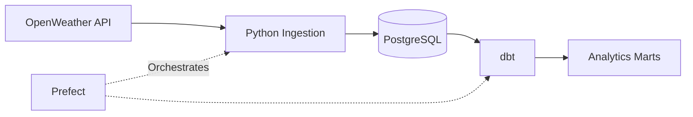
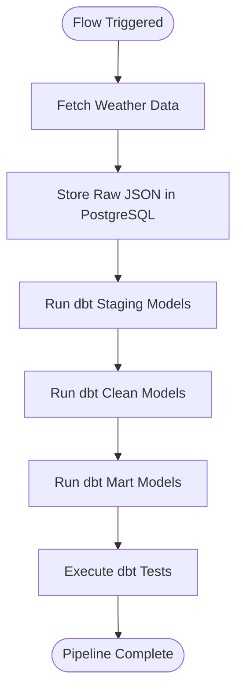
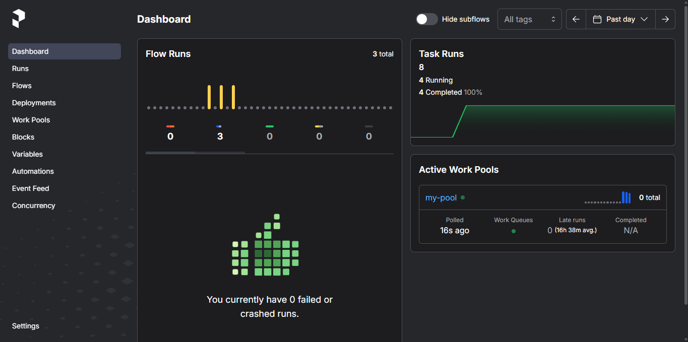
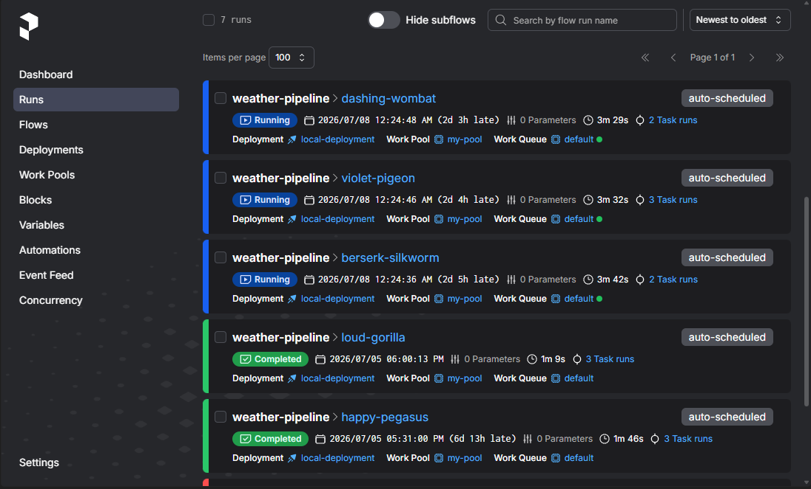
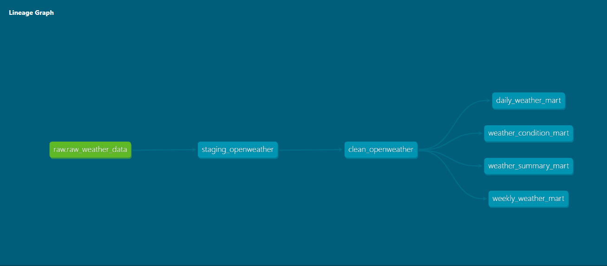
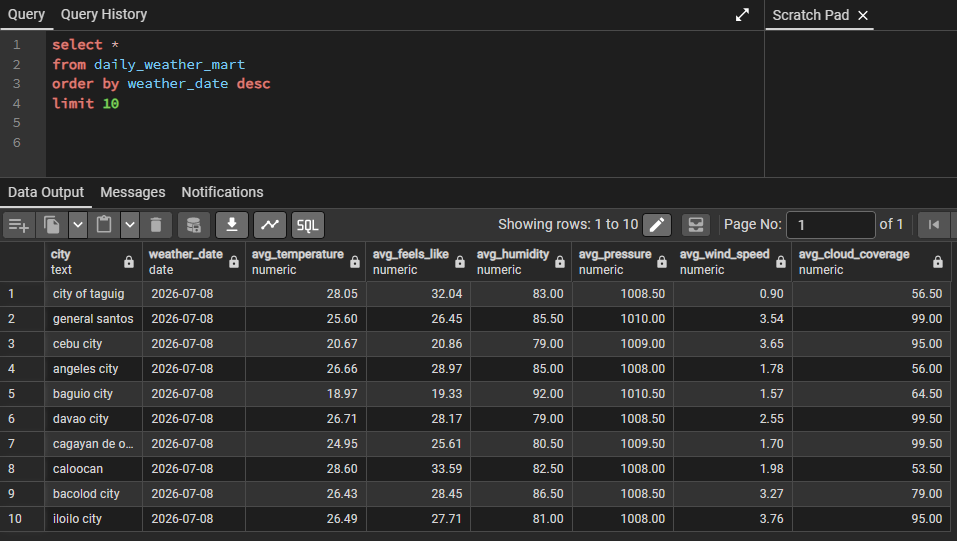

# Automated Weather Data ELT Pipeline

## Overview

This project demonstrates an automated ELT weather data pipeline built with Python, PostgreSQL, dbt, and Prefect.

The pipeline retrieves weather data from the OpenWeather API, stores raw JSON payloads in PostgreSQL, orchestrates transformations and data quality tests with Prefect and dbt, and produces analytics-ready tables for reporting and analysis.

## System Architecture



## Tech Stack

| Category | Technology |
|----------|------------|
| Programming | Python |
| Database | PostgreSQL |
| Data Transformation | dbt |
| Orchestration | Prefect |
| Database Driver | psycopg2 |
| Configuration | python-dotenv |
| Data Format | JSON / JSONB |

## Features

- Automated weather data ingestion from the OpenWeather API
- Workflow orchestration using Prefect
- Raw JSON weather data storage in PostgreSQL
- Data transformation using dbt staging, cleaning, and mart models
- Data quality validation with dbt tests
- Analytics-ready weather marts for reporting and analysis
- Environment-based configuration using `.env`

## Project Structure
.
├── Orchestration/
│   └── weather_flow,py
├── screenshots/
├── src/
│   ├── ingestion.py
│   └── setup_db.py
├── weather_dbt/
│   ├── models/
│   ├── tests/
│   └── dbt_project.yml
├── .env.example
├── README.md
└── requirements.txt

## Quick Start

### Prerequisites

- Python 3.11.5
- PostgreSQL
- dbt Core
- Prefect

### Installation

### Installation

Clone the repository:

```bash
git clone https://github.com/vaniir/weather-data-pipeline-v2
cd weather-data--pipeline-v2
```

Create and activate a virtual environment:

```bash
python -m venv .venv
```

**Windows**

```bash
.venv\Scripts\activate
```

**Linux/macOS**

```bash
source .venv/bin/activate
```

Install the required dependencies:

```bash
pip install -r requirements.txt
```

### Configuration

1. Create a PostgreSQL database.
2. Copy `.env.example` to `.env` and update the connection details.
3. Configure your dbt profile.
4. Run `setup_db.py` to initialize the database.

### Run the Pipeline

Start the Prefect server.

```bash
prefect server start
```

Create the deployment.

```bash
prefect deploy weather_flow.py:weather_data_pipeline -n local-deployment -p my-pool
```
**Note:** The deployment only needs to be recreated if the flow definition changes.

Start the Prefect worker.

```bash
prefect worker start --pool my-pool
```

The worker will poll the work pool and execute scheduled flow runs.

## Pipeline Workflow



## Data Quality

The pipeline uses dbt tests to validate critical fields during the transformation process.

Current validations include:

- Non-null city values
- Non-null country values
- Non-null temperature values
- Non-null humidity values

Current validations focus on required fields such as city, country, temperature, and humidity. Additional validation rules can be incorporated as data quality requirements evolve.

## Analytics Marts

The pipeline produces analytics-ready marts, including:

- Daily weather summaries
- Weekly weather summaries
- Weather condition statistics
- City-level weather summaries

## Screenshots

### Prefect Dashboard

The Prefect dashboard provides an overview of registered flows, deployments, and workers.



### Flow Runs

The Flow Runs page shows the execution history of the pipeline, including completed and active runs with their execution status.



### dbt Lineage Graph

The dbt lineage graph visualizes model dependencies from the raw data source through staging, cleaning, and analytics marts.



### Sample Query Results

Example output from the analytics marts after the ELT pipeline completes successfully.



## Future Improvements

- Migrate orchestration from a local Prefect server to Prefect Cloud
- Deploy the pipeline to a cloud-based data platform using Snowflake and AWS
- Expand dbt data quality tests with additional validation rules
- Integrate additional weather data sources
- Containerize the pipeline with Docker